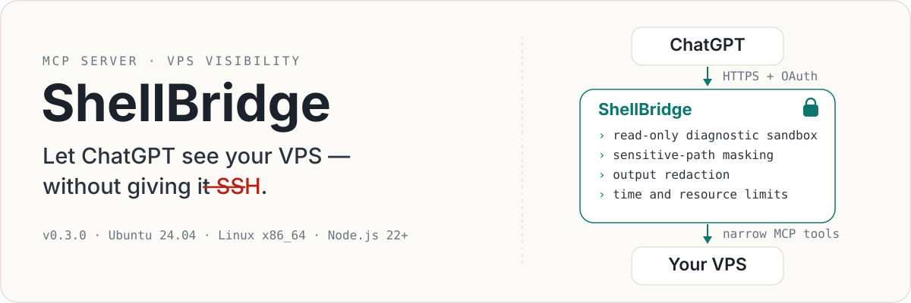
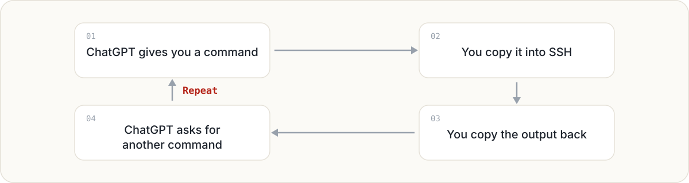
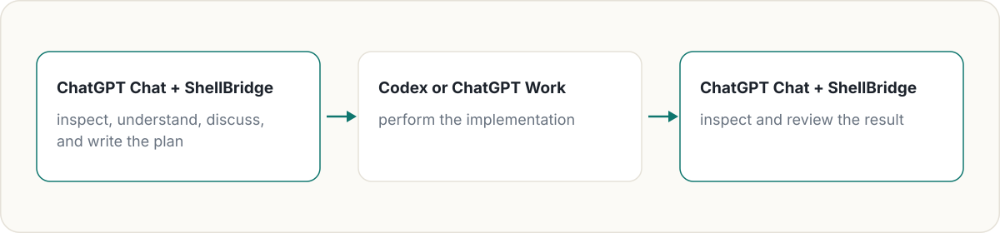
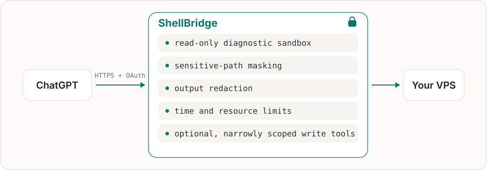

<p align="center">
  
</p>

# ShellBridge

English | [简体中文](README.zh-CN.md)

[](https://github.com/fengyincheng/ShellBridge/actions/workflows/ci.yml)
[](LICENSE)
[](#supported-platform)

## Let ChatGPT see your VPS — without giving it SSH.

**Say goodbye to “copy this command into your VPS and send me the output.”**

ShellBridge connects ordinary ChatGPT conversations to your Linux VPS through MCP. It gives ChatGPT enough current, controlled, and auditable information to investigate your server, explain what is happening, and write plans grounded in the system that actually exists.

Ask ChatGPT things like:

- “What is using all the disk space?”
- “Why is this project failing its tests?”
- “What changed in this Git repository?”
- “Check whether this configuration is complete without revealing its secrets.”
- “Review the current implementation and write a detailed plan for Codex.”
- “Inspect the result after Codex finishes and tell me whether it is safe to commit.”

General diagnostics run inside a read-only, network-isolated sandbox. Sensitive paths are hidden automatically. Persistent capabilities are narrow, disabled by default, and separately controlled by the server owner.

> **Public Preview · v0.3.0**
>
> Ubuntu 24.04 · Linux x86_64 · Node.js 22+

---

## Why use ShellBridge?

### 1. Give ChatGPT enough information to write a genuinely useful plan

ChatGPT is especially useful for conversation, synthesis, explanation, and long-form writing. It can turn a complicated technical situation into an architecture review, troubleshooting guide, migration plan, implementation brief, or precise handoff for another developer.

But good plans require good context.

Without access to the VPS, ChatGPT only knows the fragments you remember to paste into the conversation. Important files, repository state, test results, logs, and configuration details are easily missed.

ShellBridge lets ChatGPT inspect the relevant evidence directly. When the information is complete, the resulting plan can be specific to your real system rather than a generic checklist.

That plan can then be reviewed by you and handed to Codex, ChatGPT Work, another coding agent, or a human developer.

### 2. Stop being a human copy-and-paste bridge

Without ShellBridge, a technical conversation often becomes:

<p align="center">
  
</p>

This is slow and surprisingly error-prone. Output gets truncated, commands run in the wrong directory, context is lost between messages, and the user becomes a manual transport layer between two windows.

ShellBridge removes that repetitive relay. ChatGPT can perform a read-only check, inspect the result, follow up with another diagnostic, and keep the investigation inside one conversation.

You stay in control without spending the conversation moving text around by hand.

### 3. Use Chat for understanding — save Codex and Work for execution

ShellBridge does **not** try to replace Codex.

Use ChatGPT Chat with ShellBridge to:

- inspect the real state of a VPS;
- discuss a problem interactively;
- combine files, logs, tests, and repository state;
- explain unfamiliar systems in plain language;
- compare possible approaches;
- write detailed implementation plans;
- prepare exact handoff instructions;
- review completed work.

Then use Codex or ChatGPT Work when the task genuinely needs sustained execution, broad file edits, or autonomous implementation.

OpenAI’s current documentation places Codex and ChatGPT Work in the same agentic usage pool, while Chat remains the separate conversational experience. ShellBridge lets you use ordinary Chat for investigation, explanation, and long-form planning while saving the shared Codex/Work allowance for execution-heavy tasks. Usage policies can change, so check [ChatGPT Work and Codex](https://help.openai.com/en/articles/20001275-chatgpt-work-and-codex) and the [current Codex usage documentation](https://help.openai.com/en/articles/11369540) for your plan.

<p align="center">
  
</p>

---

## Does ShellBridge turn ChatGPT into another Codex?

**No — and that is not the goal.**

Codex is an execution-focused coding agent. It is designed to enter a workspace, edit files, run commands, and complete implementation tasks.

ShellBridge gives ChatGPT something different: enough safe, current, and structured information to understand what is happening on your VPS.

ChatGPT remains a conversational model. ShellBridge does not grant it unrestricted workspace control, turn it into an autonomous coding agent, or provide a general-purpose remote shell.

Instead, ShellBridge connects the reasoning and planning layer to reality:

```text
ShellBridge provides visibility, not unrestricted authority.
ChatGPT investigates and plans.
Codex or Work implements.
You remain in control.
```

---

## Why not just expose SSH?

An ordinary SSH session gives its caller broad, interactive authority. Most diagnostic questions do not need that much power.

ShellBridge exposes narrow MCP tools instead:

<p align="center">
  
</p>

ChatGPT gets enough visibility to investigate effectively without receiving unrestricted SSH access.

The service is still security-sensitive infrastructure: a root-managed process constructs these boundaries and controls which host paths are visible. Read the [threat model](docs/threat-model.md) before deployment.

---

## What can ChatGPT do?

### Understand your VPS

ChatGPT can use full Bash syntax inside a read-only view of the directories you choose.

Typical tasks include:

- inspecting files and directory structures;
- checking disk usage and file sizes;
- searching source code and logs;
- reading project metadata;
- comparing configuration state;
- running diagnostic pipelines;
- performing several related checks in one batch.

The generic diagnostic shell cannot persist changes to the host.

### Inspect configuration safely

You can register specific JSON or environment files and explicitly allow selected fields to be inspected.

Credential values are never returned directly. Sensitive fields are reduced to states such as:

```text
missing
empty
set / redacted
```

This allows ChatGPT to answer questions such as:

> “Is this application configured with the required credentials?”

without exposing the credential itself.

### Run existing project tasks

ChatGPT can run an existing package script or project script in a disposable copy of the project.

Examples include:

```text
npm test
npm run check
python scripts/validate.py
```

The temporary copy is writable so builds and test caches can work, but all changes are discarded when the task ends. The original project is not modified, and the task has no network access.

### Review local Git repositories

ShellBridge supports narrowly scoped local Git operations:

- inspect repository status;
- stage explicit paths;
- unstage explicit paths;
- prepare an exact local commit;
- execute only the previously prepared commit.

It does not support remote Git operations such as push, pull, or fetch.

### Perform optional controlled changes

When explicitly enabled by the server owner, ShellBridge can:

- create, replace, patch, and move Markdown or text documents;
- stage and unstage local Git paths;
- prepare and execute an immutable local commit proposal;
- prepare a pre-existing maintenance or deployment script for execution.

These capabilities are disabled by default. ShellBridge does not provide an arbitrary host-write shell.

---

## How does ShellBridge keep this safe?

ShellBridge treats model-generated commands, arguments, repository contents, and command output as untrusted input.

### Read-only by default

General diagnostics run as an unprivileged identity inside a read-only Bubblewrap filesystem view.

### No network access

The diagnostic sandbox receives an isolated network namespace. Network and Unix socket creation are additionally restricted with seccomp.

### Sensitive paths are hidden

Known credential, session, private-key, database, shell-history, browser-profile, cloud-client, and control-socket paths are masked from the sandbox. Administrators can block additional paths.

### Output is redacted

ShellBridge scans command output for credential-like material before returning it to ChatGPT. Registered configuration readers apply stricter field-level disclosure rules.

### Commands are bounded

Diagnostic and project tasks are constrained by timeouts, output limits, process limits, file-size limits, memory limits, rlimits, and cgroup controls.

### Write tools are separate

Persistent capabilities do not inherit permission from read-only shell access. They require both the global write switch and the switch for the exact capability being used.

### Consequential actions are frozen

Local Git commits and pre-existing script executions use an immutable prepare/execute flow.

Preparation records the exact repository or script identity, content state, arguments, working directory, resource limits, and relevant Git state. Execution accepts only the generated proposal ID, revalidates the frozen state, and prevents replay.

---

## Quick start

### Requirements

ShellBridge Public Preview currently requires:

- Ubuntu 24.04;
- Linux x86_64;
- Node.js 22 or newer;
- Bubblewrap;
- cgroup v2;
- a C17 compiler;
- root access for the supported deployment model.

Install the Ubuntu prerequisites:

```bash
sudo apt-get update
sudo apt-get install --yes build-essential bubblewrap
```

### Build ShellBridge

```bash
git clone https://github.com/fengyincheng/ShellBridge.git
cd ShellBridge

npm ci
npm run build
cp .env.example .env
```

Open `.env` and follow the comments for the required credentials, database path, public URL, and readable roots.

Generate the required 32-byte data key with:

```bash
openssl rand -base64 32
```

Load the environment and run the read-only preflight:

```bash
set -a
. ./.env
set +a

npm run doctor
```

Then start ShellBridge:

```bash
npm start
```

ShellBridge listens on loopback only. The default address is:

```text
127.0.0.1:8765
```

The listen host cannot be changed to `0.0.0.0`.

---

## Connect ChatGPT

For remote access, put an HTTPS reverse proxy or authenticated tunnel in front of ShellBridge:

```text
ChatGPT
   │
   │ HTTPS
   ▼
Reverse proxy or authenticated tunnel
   │
   │ loopback
   ▼
127.0.0.1:8765
```

Set `SHELLBRIDGE_PUBLIC_BASE_URL` to the deployment’s exact public HTTPS origin.

The MCP endpoint will be:

```text
https://shellbridge.example.com/mcp
```

ShellBridge publishes the OAuth authorization-server and protected-resource metadata that ChatGPT needs, derived from the same public URL.

See [ChatGPT connection guidance](docs/chatgpt-guidance.md) for the connection contract and expected client behavior.

Never expose port `8765` directly to the public internet.

---

## systemd deployment

An example root-managed unit is included under:

```text
deploy/systemd/
```

The supplied unit assumes ShellBridge is installed at `/opt/shellbridge`.

Install the templates:

```bash
sudo install -d -o root -g root -m 0700 \
  /etc/shellbridge \
  /var/lib/shellbridge

sudo install -o root -g root -m 0600 \
  deploy/systemd/shellbridge.env.example \
  /etc/shellbridge/shellbridge.env

sudo install -o root -g root -m 0644 \
  deploy/systemd/shellbridge.service \
  /etc/systemd/system/shellbridge.service
```

Populate every required value in `/etc/shellbridge/shellbridge.env`, then:

```bash
sudo systemctl daemon-reload
sudo systemctl enable --now shellbridge
```

Review all paths and settings before starting the service. The included unit is an Ubuntu 24.04 example, not a universal distribution package.

---

## Capability switches

All persistent capabilities are disabled by default:

```text
SHELLBRIDGE_WRITE_ACTIONS_ENABLED=false
SHELLBRIDGE_DOCUMENT_WRITES_ENABLED=false
SHELLBRIDGE_LOCAL_GIT_WRITES_ENABLED=false
SHELLBRIDGE_EXISTING_SCRIPT_RUNS_ENABLED=false
```

The global switch and the relevant capability switch must both be enabled locally. Enabling one capability does not unlock unrelated write operations.

---

## What ShellBridge does not do

ShellBridge intentionally does not provide:

- unrestricted SSH access;
- arbitrary host-write shell commands;
- general internet access from diagnostic commands;
- remote Git push, pull, or fetch;
- package installation or system upgrades;
- automatic deployment or service management;
- automatic DNS, TLS, tunnel, or firewall configuration;
- multi-tenant authorization;
- ARM64, Docker, or Kubernetes support in this preview.

These are product boundaries, not missing shortcuts to be bypassed.

---

## Supported platform

The current support matrix is intentionally narrow:

| Component | Supported |
|---|---|
| Operating system | Ubuntu 24.04 |
| Architecture | Linux x86_64 |
| Node.js | 22 or newer |
| Sandbox | Bubblewrap |
| Resource control | cgroup v2 |
| Service model | Root-managed |
| ARM64 | Not supported |
| Docker / Kubernetes | Not supported |

The native build fails clearly on unsupported operating systems and CPU architectures.

---

## Documentation

- [ChatGPT connection guidance](docs/chatgpt-guidance.md)
- [MCP interface](docs/mcp.md)
- [Implemented capabilities](docs/implementation-status.md)
- [Consequential tool contracts](docs/consequential-tools.md)
- [Security threat model](docs/threat-model.md)
- [Implementation defaults](docs/implementation-defaults.md)
- [Security policy](SECURITY.md)
- [Contributing guide](CONTRIBUTING.md)
- [Changelog](CHANGELOG.md)

---

## Development

Run the ordinary tests and build:

```bash
npm run check
```

The ordinary suite uses controlled test doubles for generic shell execution.

Privileged native acceptance tests require a supported, disposable Ubuntu 24.04 x86_64 host with root access, Bubblewrap, and writable cgroup v2:

```bash
sudo --preserve-env=PATH npm run test:privileged
```

Do not run privileged acceptance tests on a host you have not prepared for their mount and cgroup fixtures.

---

## Security

ShellBridge is security-sensitive infrastructure.

Before deploying it:

- read the [threat model](docs/threat-model.md);
- review the configured readable and blocked paths;
- keep the service bound to loopback;
- put authenticated HTTPS in front of it;
- keep persistent capabilities disabled unless needed;
- deploy it on a dedicated or clearly isolated VPS where practical.

ShellBridge does not replace operating-system hardening, account isolation, backups, or careful administration.

To report a vulnerability, follow [SECURITY.md](SECURITY.md) rather than opening a public issue.

---

## Public Preview

ShellBridge v0.3.0 is an early public release. The security model, supported platform, configuration format, and MCP tools may change as the project receives real-world review.

Feedback, testing, documentation improvements, and carefully scoped contributions are welcome.

---

## License

ShellBridge is licensed under the [Apache License 2.0](LICENSE).
