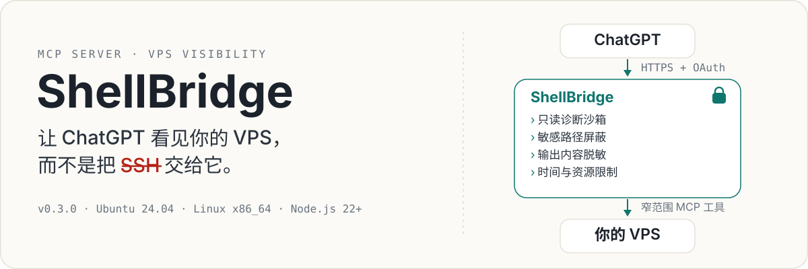
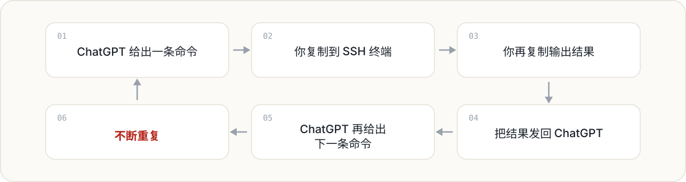
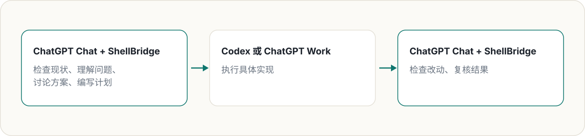
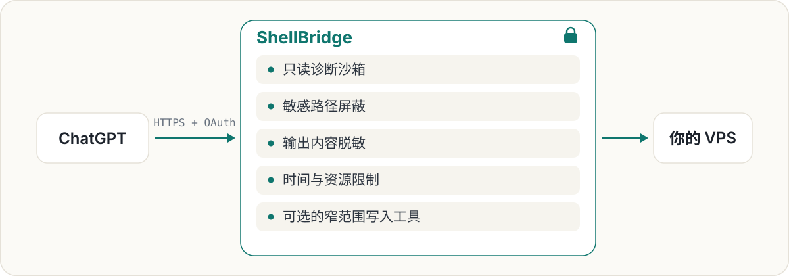

<p align="center">
  
</p>

# ShellBridge

[English](README.md) | 简体中文

[](https://github.com/fengyincheng/ShellBridge/actions/workflows/ci.yml)
[](LICENSE)
[](#支持环境)

## 让 ChatGPT 看见你的 VPS，而不是把 SSH 交给它

**彻底告别这句话：“请把下面这段命令复制到 VPS 中执行，然后把输出结果发给我。”**

ShellBridge 通过 MCP 将普通 ChatGPT 对话连接到你的 Linux VPS。它让 ChatGPT 获得足够及时、受控且可审计的服务器信息，从而直接调查问题、解释系统现状，并根据真实环境写出详细计划。

你可以直接问 ChatGPT：

- “磁盘空间都被什么占满了？”
- “这个项目为什么测试失败？”
- “这个 Git 仓库现在有哪些改动？”
- “检查配置是否完整，但不要显示任何密钥。”
- “审查当前实现，并为 Codex 写一份详细修改计划。”
- “Codex 做完了，检查结果是否适合提交。”

普通诊断命令会在一个**只读、断网、受限制的沙箱**中运行。敏感路径会被自动隐藏。所有持久化能力都经过单独限制，默认关闭，并由服务器所有者在本地控制。

> **Public Preview · v0.3.0**
>
> Ubuntu 24.04 · Linux x86_64 · Node.js 22+

---

## 为什么使用 ShellBridge？

### 1. 让 ChatGPT 获得足够的信息，真正写出一份好计划

ChatGPT 很擅长对话、综合分析、解释复杂系统和长文本写作。它可以把混乱的技术现状整理成架构审查、故障排查指南、迁移方案、实现计划，或者一份可以直接交给开发者和编码 Agent 的精确任务说明。

但一份好计划，首先需要完整、准确的上下文。

在没有 ShellBridge 时，ChatGPT 只能看到你记得复制进对话里的零散信息。关键文件、Git 状态、测试结果、日志、目录结构和配置细节都很容易被遗漏。

ShellBridge 让 ChatGPT 直接检查相关证据。当信息足够完整时，它写出的计划就可以针对**你实际存在的系统**，而不是基于猜测生成一份通用清单。

计划经你确认后，可以交给 Codex、ChatGPT Work、其他编码 Agent 或人类开发者执行。

### 2. 不再充当 ChatGPT 与终端之间的人肉中转站

没有 ShellBridge 时，一次技术排查通常是这样的：

<p align="center">
  
</p>

这个过程不只麻烦，还很容易出错：

- 输出被聊天框截断；
- 命令在错误的目录运行；
- 复制时遗漏关键行；
- 多轮之后上下文混乱；
- 你被迫在两个窗口之间反复搬运文本。

ShellBridge 会移除这层重复劳动。ChatGPT 可以自己完成一次只读检查，阅读结果，再根据结果继续下一项诊断，并把整个调查过程留在同一段对话里。

你仍然掌握控制权，但不再需要充当人工数据传输线。

### 3. 用 Chat 理解和规划，把 Codex / Work 留给真正的执行

ShellBridge **不是为了取代 Codex**。

ChatGPT Chat 配合 ShellBridge，适合：

- 查看 VPS 的真实状态；
- 与你一起讨论问题；
- 综合文件、日志、测试和 Git 状态；
- 用易懂的语言解释陌生系统；
- 比较不同实现方案；
- 编写详细的修改计划；
- 准备精确的 Agent 交接说明；
- 在执行完成后复核结果。

当任务真正需要持续执行、大范围编辑文件或自主完成实现时，再交给 Codex 或 ChatGPT Work。

OpenAI 当前文档将 Codex 与 ChatGPT Work 归入同一套 agentic usage 结构，而 Chat 仍是独立的对话体验。ShellBridge 让你可以使用普通 Chat 完成调查、解释和长文本规划，把共享的 Codex / Work agentic 额度留给真正需要执行的任务。使用规则可能变化，请以 [ChatGPT Work and Codex](https://help.openai.com/zh-hans-cn/articles/20001275-chatgpt-work-and-codex) 和 [Codex 当前使用说明](https://help.openai.com/en/articles/11369540) 为准。

推荐的工作方式：

<p align="center">
  
</p>

---

## ShellBridge 会把 ChatGPT 变成另一个 Codex 吗？

**不会，而且这也不是它的目标。**

Codex 是一个面向执行的编码 Agent。它擅长进入项目工作区、编辑源码、运行命令并持续完成实现任务。

ShellBridge 给 ChatGPT 的是另一种能力：

> 获得足够安全、及时、结构化的信息，从而理解 VPS 上实际发生了什么。

ChatGPT 仍然是一个对话模型。ShellBridge 不会：

- 给它无限制的工作区控制权；
- 把它变成自主编码 Agent；
- 提供通用的远程 root shell；
- 让它绕过服务器本地安全策略。

ShellBridge 做的是把**理解与规划层**连接到真实环境：

```text
ShellBridge 提供可见性，而不是无限制权限。
ChatGPT 负责调查、解释和计划。
Codex 或 Work 负责执行。
你始终保留最终控制权。
```

---

## 为什么不直接把 SSH 交给 ChatGPT？

普通 SSH 会给调用者非常广泛的交互权限，但绝大多数诊断问题根本不需要这么大的权限。

ShellBridge 提供的是一组受限制的 MCP 工具：

<p align="center">
  
</p>

ChatGPT 可以获得足够的信息来有效调查问题，但不会获得无限制 SSH 权限。

ShellBridge 本身仍然属于安全敏感的基础设施：它由 root 管理，负责构建沙箱边界并决定哪些宿主路径可见。部署前请阅读[威胁模型](docs/threat-model.md)。

---

## ChatGPT 可以做什么？

### 了解你的 VPS

ChatGPT 可以在你指定目录的只读视图中使用完整 Bash 语法。

常见用途包括：

- 查看文件和目录结构；
- 检查磁盘占用；
- 查找大文件；
- 搜索源码和日志；
- 阅读项目元数据；
- 比较配置状态；
- 运行诊断管道；
- 一次执行多项相关检查。

普通诊断 Shell 无法把修改持久化到宿主机。

### 安全检查配置

管理员可以注册特定的 JSON 或环境变量文件，并明确允许 ChatGPT 检查哪些字段。

凭据值不会直接返回。敏感字段只会显示为：

```text
未设置
空值
已设置 / 已脱敏
```

因此 ChatGPT 可以回答：

> “这个应用需要的 API 凭据是否已经配置？”

但不会看到凭据原文。

### 运行项目已有任务

ChatGPT 可以在项目的临时副本中运行已经存在的包脚本或项目脚本。

例如：

```text
npm test
npm run check
python scripts/validate.py
```

临时副本允许写入，因此构建过程和测试缓存可以正常工作。但任务结束后，所有临时改动都会被丢弃：

- 原项目不会被修改；
- 任务无法访问网络；
- 不会产生持久化副作用。

### 审查本地 Git 仓库

ShellBridge 支持有限的本地 Git 操作：

- 查看仓库状态；
- 暂存明确指定的路径；
- 取消暂存明确指定的路径；
- 准备一个内容完全确定的本地提交；
- 只执行先前已经冻结的提交方案。

ShellBridge 不支持远程 Git 操作，包括 push、pull 和 fetch。

### 执行可选的受控修改

当服务器所有者明确开启相关能力后，ShellBridge 可以：

- 创建、替换、补丁修改或移动 Markdown / TXT 文档；
- 暂存或取消暂存本地 Git 路径；
- 准备并执行不可变的本地 Git 提交；
- 准备一个已经存在的维护或部署脚本。

这些能力默认全部关闭。ShellBridge 不提供任意宿主机写入 Shell。

---

## ShellBridge 如何保证安全？

ShellBridge 将模型生成的命令、MCP 参数、仓库内容、脚本输出和动态客户端元数据全部视为不可信输入。

### 默认只读

普通诊断命令以无特权身份运行，并处于只读 Bubblewrap 文件系统视图中。

### 禁止网络访问

诊断沙箱使用独立的网络命名空间。网络 Socket 和 Unix Socket 的创建还会受到 seccomp 限制。

### 隐藏敏感路径

已知敏感资源会从沙箱中被屏蔽，例如：

- SSH 凭据；
- 云平台凭据；
- API Token；
- 登录会话文件；
- 私钥；
- 数据库文件；
- Shell 历史；
- 浏览器配置；
- GitHub CLI 凭据；
- 进程管理器控制 Socket。

管理员也可以额外配置需要屏蔽的路径。

### 自动脱敏输出

ShellBridge 会在命令输出返回 ChatGPT 之前扫描可能的凭据内容。注册配置读取器还会执行更严格的字段级披露规则。

### 限制命令资源

诊断命令和项目任务受到以下限制：

- 执行超时；
- 最大输出长度；
- 进程数量；
- 最大文件大小；
- 内存使用；
- rlimit；
- cgroup 资源控制。

### 写入工具与读取工具分离

获得只读 Shell 权限，并不意味着自动拥有写入权限。

持久化能力同时要求：

1. 开启全局写入开关；
2. 开启对应能力的单独开关；
3. 使用为该操作专门设计的工具。

### 高影响操作会被冻结

本地 Git 提交和已有脚本执行使用不可变的 prepare / execute 流程。

准备阶段会记录并冻结：

- 仓库或脚本身份；
- 文件内容和 inode 状态；
- 参数；
- 工作目录；
- 资源限制；
- 相关 Git 状态。

执行阶段只接受生成的 `approval_id`。系统会重新验证被冻结的状态，并阻止重复执行。

---

## 快速开始

### 环境要求

ShellBridge Public Preview 当前要求：

- Ubuntu 24.04；
- Linux x86_64；
- Node.js 22 或更高版本；
- Bubblewrap；
- cgroup v2；
- C17 编译器；
- root 管理的服务模式。

安装 Ubuntu 依赖：

```bash
sudo apt-get update
sudo apt-get install --yes build-essential bubblewrap
```

### 构建 ShellBridge

```bash
git clone https://github.com/fengyincheng/ShellBridge.git
cd ShellBridge

npm ci
npm run build
cp .env.example .env
```

打开 `.env`，根据其中注释配置必要凭据、数据库路径、公网 URL 和允许读取的目录。

生成所需的 32 字节数据加密密钥：

```bash
openssl rand -base64 32
```

加载环境变量并运行只读环境检查：

```bash
set -a
. ./.env
set +a

npm run doctor
```

启动 ShellBridge：

```bash
npm start
```

ShellBridge 仅监听本机回环地址：

```text
127.0.0.1:8765
```

监听地址无法配置为 `0.0.0.0`。

---

## 连接 ChatGPT

远程连接时，需要在 ShellBridge 前方配置 HTTPS 反向代理或经过身份认证的隧道：

```text
ChatGPT
   │
   │ HTTPS
   ▼
反向代理或认证隧道
   │
   │ loopback
   ▼
127.0.0.1:8765
```

将 `SHELLBRIDGE_PUBLIC_BASE_URL` 设置为部署使用的完整 HTTPS 公网源地址。

MCP 地址将是：

```text
https://shellbridge.example.com/mcp
```

ShellBridge 会根据相同的公网 URL 发布 ChatGPT 所需的 OAuth Authorization Server Metadata、OAuth Protected Resource Metadata 和 MCP Resource 地址。

详细连接约定请阅读 [ChatGPT connection guidance](docs/chatgpt-guidance.md)。

**不要将 8765 端口直接暴露到公网。**

---

## systemd 部署

仓库包含 root 管理的 systemd 示例：

```text
deploy/systemd/
```

默认假设 ShellBridge 安装在 `/opt/shellbridge`。

安装配置模板：

```bash
sudo install -d -o root -g root -m 0700 \
  /etc/shellbridge \
  /var/lib/shellbridge

sudo install -o root -g root -m 0600 \
  deploy/systemd/shellbridge.env.example \
  /etc/shellbridge/shellbridge.env

sudo install -o root -g root -m 0644 \
  deploy/systemd/shellbridge.service \
  /etc/systemd/system/shellbridge.service
```

填写 `/etc/shellbridge/shellbridge.env` 中的全部必要配置，然后启动服务：

```bash
sudo systemctl daemon-reload
sudo systemctl enable --now shellbridge
```

启动前请检查所有路径和设置。仓库提供的是 Ubuntu 24.04 示例，而不是适用于所有发行版的通用安装包。

---

## 能力开关

所有持久化操作默认关闭：

```text
SHELLBRIDGE_WRITE_ACTIONS_ENABLED=false
SHELLBRIDGE_DOCUMENT_WRITES_ENABLED=false
SHELLBRIDGE_LOCAL_GIT_WRITES_ENABLED=false
SHELLBRIDGE_EXISTING_SCRIPT_RUNS_ENABLED=false
```

必须同时开启全局写入开关和对应能力的单独开关。开启一种能力不会自动解锁其他写入操作。

---

## ShellBridge 不会做什么？

ShellBridge 有意不提供：

- 无限制 SSH 访问；
- 任意宿主机写入 Shell；
- 诊断命令的通用互联网访问；
- Git push、pull 或 fetch；
- 安装软件包或自动升级系统；
- 自动部署或自动管理服务；
- 自动配置 DNS、TLS、隧道或防火墙；
- 多租户授权；
- ARM64 支持；
- Docker 或 Kubernetes 支持。

这些是明确的产品边界，而不是应该被绕过的限制。

---

## 支持环境

| 组件 | 当前支持 |
|---|---|
| 操作系统 | Ubuntu 24.04 |
| 架构 | Linux x86_64 |
| Node.js | 22 或更高版本 |
| 沙箱 | Bubblewrap |
| 资源控制 | cgroup v2 |
| 服务模式 | root 管理 |
| ARM64 | 不支持 |
| Docker / Kubernetes | 不支持 |

在不支持的操作系统或 CPU 架构上，原生构建会明确失败。

---

## 文档

- [ChatGPT 连接说明](docs/chatgpt-guidance.md)
- [MCP 接口](docs/mcp.md)
- [当前已实现能力](docs/implementation-status.md)
- [高影响工具契约](docs/consequential-tools.md)
- [安全威胁模型](docs/threat-model.md)
- [实现默认值](docs/implementation-defaults.md)
- [安全政策](SECURITY.md)
- [贡献指南](CONTRIBUTING.md)
- [更新日志](CHANGELOG.md)

---

## 开发

运行普通测试和构建：

```bash
npm run check
```

普通测试套件会对通用 Shell 执行使用受控测试替身。

特权原生验收测试需要一台可随时丢弃的 Ubuntu 24.04 x86_64 主机，并具备 root 权限、Bubblewrap 和可写 cgroup v2：

```bash
sudo --preserve-env=PATH npm run test:privileged
```

不要在未专门准备的生产主机上运行特权验收测试。

---

## 安全

ShellBridge 是安全敏感的基础设施。

部署前请：

- 阅读[威胁模型](docs/threat-model.md)；
- 检查允许读取和禁止读取的路径；
- 保持服务仅监听 loopback；
- 在服务前方配置经过身份认证的 HTTPS；
- 除非确有需要，否则不要开启持久化能力；
- 尽可能部署在专用或明确隔离的 VPS 上。

ShellBridge 不能代替操作系统安全加固、账号隔离、备份或谨慎的服务器管理。

报告安全漏洞时，请遵循 [SECURITY.md](SECURITY.md)，不要直接创建公开 Issue。

---

## Public Preview

ShellBridge v0.3.0 是第一个公开预览版本。随着真实环境测试和外部安全审查的增加，安全模型、支持平台、配置格式和 MCP 工具接口都可能发生变化。

欢迎提供实际使用反馈、测试结果、文档改进，以及范围明确且经过充分考虑的贡献。

---

## 许可证

ShellBridge 使用 [Apache License 2.0](LICENSE) 开源。
